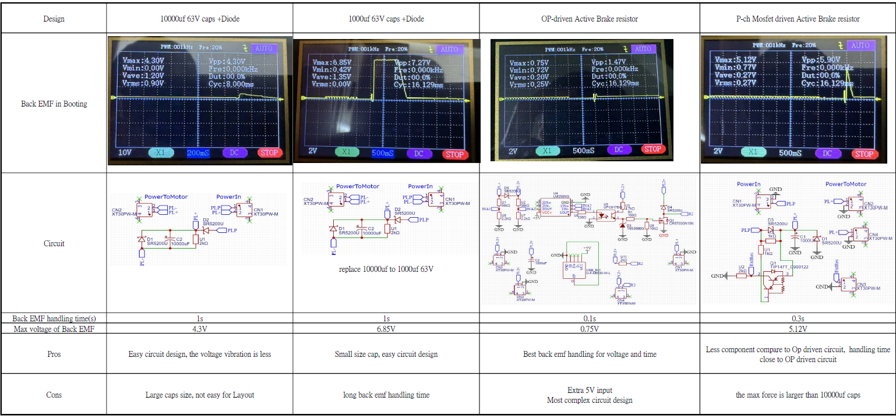
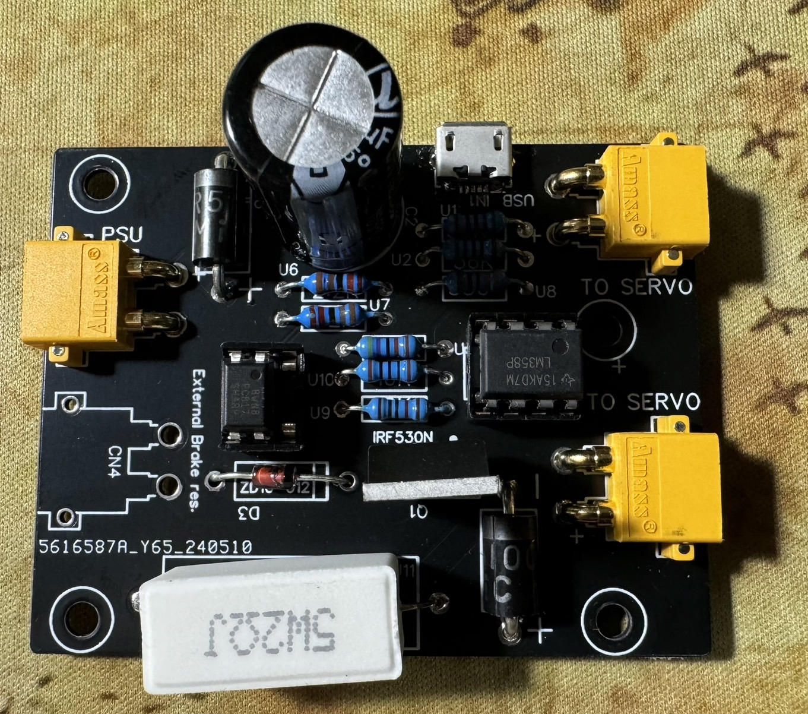
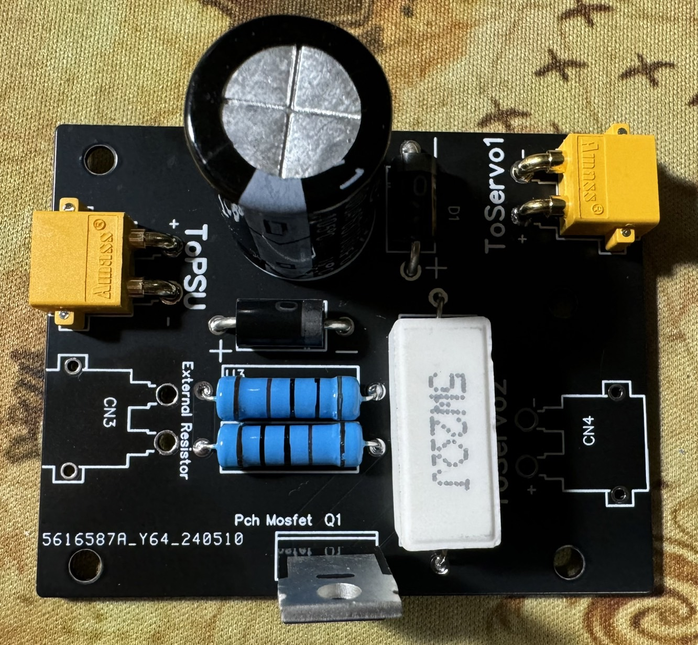

# Brake_resistor_Control_Circuit
This project is a sub project for [DIY FFB Pedal](https://github.com/ChrGri/DIY-Sim-Racing-FFB-Pedal)

OP driven circuit credit belong to Adilrepas(discord) 
Pch Mosfet circuit is from: https://drmrehorst.blogspot.com/2022/05/bank-account-protection-circuit-for.html and provide by mnu-warning 

# Comparison of each brake resistor circuit 
 

# OP driven Brake resistor circuit
 

| Item           |  Quantity |
:------------------------- | :-------------------------
| Cap 1000uf 50V| 1|
| XT30PW-M| 4|
| Micro-USB connector SMT| 1|
| 5W 2 Ohm resistor| 1|
| CRST030N10N(IRF530N)| 1|
| SR5100| 2|
| ZD10-012 diode| 1|
| LM358G OP| 1|
| PC817| 1|
| 1/4W 10K Ohm| 1|
| 1/4W 100 Ohm| 1|
| 1/4W 4.7K Ohm| 1|
| 1/4W 330 Ohm| 1|
| 1/4W 2.2K Ohm| 2|
| 1/4W 56K Ohm| 2|

# P channel Mosfet driven Brake resistor circuit
 
## IRF9540N mosfet driven 

| Item           |  Quantity |
:------------------------- | :-------------------------
| Cap 1000uf 63V| 1|
| XT30PW-M| 4|
| 5W 2 Ohm resistor| 1|
| SR5100| 2|
| 1W 1K Ohm| 2|
| IRF9540N| 1|

Note: if mosfet failed during homing, replace 5W 2Ohm into 5W 10Ohm 

## TIP147T mosfet driven 

| Item           |  Quantity |
:------------------------- | :-------------------------
| Cap 1000uf 63V| 1|
| XT30PW-M| 4|
| 5W 33 Ohm resistor| 1|
| SR5100| 2|
| 1W 1K Ohm| 2|
| TIP147T| 1|

